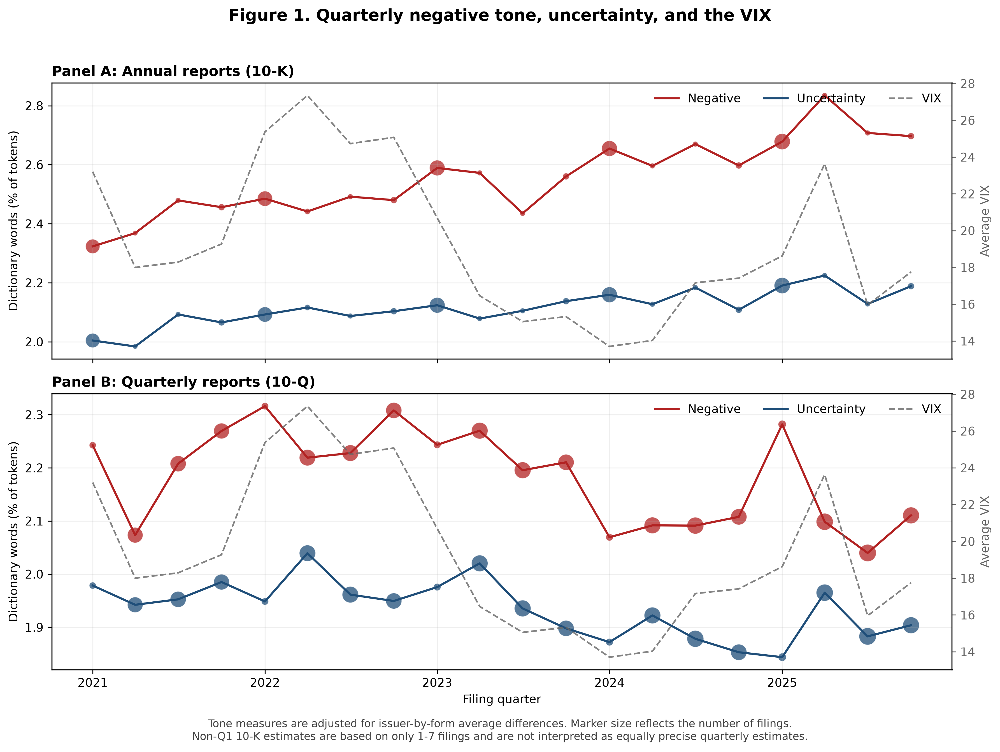

# Assignment 1 report

### Uncertainty and Sentiment Analysis of Quarterly and Annual Financial Reports

FRE-GY 7871 A · NLP and the Investment Process

**Name:** Fangyi Jiang
**NetID:** fj2034
**GitHub repo:** https://github.com/fangyi720305-ops/FRE-GY-7871A-Assignment1

---

## 1. What I did

I measured negative sentiment and uncertainty in 10-K and 10-Q filings made from 2021 through 2025 by domestic companies appearing in a frozen snapshot of the six ARK ETFs. Following Loughran and McDonald (2011), I scored each filing using both proportional word counts and tf-idf weights. I then examined quarterly trends and tested whether uncertainty predicts post-filing volatility and whether negative sentiment predicts the four-day market reaction around a filing. The final text sample contains 1,682 filings from 92 issuers.

## 2. Data construction

The initial universe contained 124 unique ARK securities. I excluded 23 foreign securities or foreign private issuers, six private or nonperiodic companies, and two fund positions. This left 93 domestic securities. Alphabet appeared as both GOOG and GOOGL, so I retained GOOGL, the class with higher average daily dollar volume, and consolidated the duplicated filings. The final text sample contains 92 issuers and 1,682 unique filings: 411 10-Ks and 1,271 10-Qs.

**Table 1. Sample construction**

**Panel A. Company-level sample**

| Step | Sample construction step | Removed | Remaining |
|---:|---|---:|---:|
| 1 | Unique securities in frozen ARK holdings | 0 | 124 |
| 2 | Exclude foreign securities/private issuers | 23 | 101 |
| 3 | Exclude private or nonperiodic companies | 6 | 95 |
| 4 | Exclude fund positions | 2 | 93 |
| 5 | Consolidate Alphabet dual share classes | 1 | 92 |

**Panel B. Filing-level text sample**

| Step | Filing-level sample step | Removed | Remaining |
|---:|---|---:|---:|
| 1 | Downloaded filing records for domestic securities | 0 | 1,702 |
| 2 | Remove duplicate Alphabet share-class filings | 20 | 1,682 |
| 3 | Remove missing or empty parsed texts | 0 | 1,682 |

**Panel C. Regression-sample availability**

| Analysis sample | Available filings | Removed from relevant base |
|---|---:|---:|
| Clean filing-text sample | 1,682 | 0 |
| Filings with point-in-time share counts | 1,619 | 63 |
| Table 5 volatility-regression sample | 1,586 | 33 |
| Table 6 filing-return regression sample | 1,586 | 33 |

The Table 5 and Table 6 exclusions are each measured relative to the 1,619 filings with point-in-time share counts; they are not sequential exclusions.

The starter parser removed inline-XBRL scaffolding and discarded a table when digits exceeded 15% of its non-space characters. It retained narrative tables. Tokens were converted to uppercase; numbers were excluded, while alphabetic words containing apostrophes or hyphens were retained. All 1,682 unique filings produced nonempty text, so parsing removed no additional filings. Point-in-time shares came from filing XBRL facts in `shares.csv`; 63 filings could not be matched.

I converted SEC acceptance timestamps to Eastern Time. A filing accepted before 4:00 p.m. on a trading day received that date as day 0; a filing accepted after the close or on a nontrading day received the next trading day. This rule moved 1,266 filings: 1,263 after-close filings and three nontrading-day filings.

## 3. Word lists

The Negative dictionary contains 2,355 words and the Uncertainty dictionary contains 297 words. Forty words appear on both lists, leaving 2,612 unique dictionary terms. Examples of overlap include `DOUBT`, `RISKY`, `VOLATILITY`, and `UNEXPECTED`.

The overlap means the two measures are not mechanically independent: an occurrence of an overlapping word contributes to both scores. However, removing all overlapping words barely changes the full-sample proportional correlation from 0.8889 to 0.8854 and the tf-idf correlation from 0.9370 to 0.9202. The strong relationship therefore reflects broader similarities in filing language rather than only the 40 shared words.

## 4. Method

For filing $d$, the proportional score for dictionary $L$ is

```math
\text{Proportion}_{d,L}
=
\frac{\sum_{w\in L} c_{d,w}}{N_d},
```

where $c_{d,w}$ is the count of word $w$ and $N_d$ is the total number of tokens in filing $d$.

I implemented the Loughran–McDonald tf-idf score as

```math
\mathrm{TFIDF}_{d,L}
=
\sum_{\substack{w\in L \\ c_{d,w}>0}}
\frac{(1+\ln c_{d,w})\ln(D/df_w)}
     {1+\ln N_d}
```

Here, $D=1{,}682$ is the number of filings and $df_w$ is the number of filings containing word $w$. I interpreted term frequency as the log-transformed within-filing count, inverse document frequency as $\ln(D/df_w)$, and the denominator as a log document-length adjustment. Document frequencies and weights were calculated using the same 1,682-filing corpus used in the analysis.

For Figure 1 and the aggregate trend tests, I first demeaned every score by its issuer-by-form average and added back the corresponding overall form average. I then averaged the adjusted values within filing quarter, keeping 10-K and 10-Q observations separate. This controls for changes in firm composition and avoids the annual sawtooth caused by the heavier concentration of long 10-K filings in the first quarter.

Aggregate trends regress quarterly scores on a linear time variable. Because there are only 20 persistent quarterly observations, I report ordinary OLS statistics and Newey–West statistics with four lags. Within-firm regressions use filing-level observations, issuer fixed effects, and standard errors clustered by issuer and filing quarter.

Market returns are adjusted using SPY. Pre-filing volatility is the annualized standard deviation of market-adjusted daily returns over trading days \([-60,-6]\), and post-filing volatility uses \([6,65]\). Filing-period return is the stock buy-and-hold return minus the SPY buy-and-hold return over \([0,3]\). Regression controls include log point-in-time market capitalization, log average turnover, prior market-adjusted return, quarter effects, and form effects in the pooled specifications.

## 5. What the measures are made of

**Table 2. Summary statistics by filing form**

| Form | Measure | N | Mean | SD | P25 | Median | P75 | Min | Max |
|---|---|---:|---:|---:|---:|---:|---:|---:|---:|
| 10-K | Negative proportion (%) | 411 | 2.5568 | 0.4507 | 2.2676 | 2.5796 | 2.8832 | 1.2768 | 3.6260 |
| 10-K | Uncertainty proportion (%) | 411 | 2.1196 | 0.2618 | 1.9473 | 2.1458 | 2.3071 | 1.4154 | 2.7948 |
| 10-K | Negative tf-idf | 411 | 50.8428 | 19.1058 | 35.8844 | 46.9250 | 63.5248 | 17.0246 | 108.4741 |
| 10-K | Uncertainty tf-idf | 411 | 8.3384 | 3.0181 | 6.0702 | 7.9196 | 9.7671 | 2.9763 | 19.2384 |
| 10-Q | Negative proportion (%) | 1,271 | 2.1685 | 1.0876 | 1.2069 | 1.7495 | 3.3301 | 0.3654 | 5.0438 |
| 10-Q | Uncertainty proportion (%) | 1,271 | 1.9377 | 0.6642 | 1.3893 | 1.7578 | 2.6114 | 0.6303 | 3.5802 |
| 10-Q | Negative tf-idf | 1,271 | 22.9261 | 22.8835 | 4.5804 | 9.4750 | 41.5606 | 0.6603 | 89.3133 |
| 10-Q | Uncertainty tf-idf | 1,271 | 3.8099 | 2.7227 | 1.6061 | 2.7972 | 5.9252 | 0.4039 | 12.8218 |

**Correlation between Negative and Uncertainty**

| Sample | N | Proportional | Proportional excluding overlap | TF-IDF | TF-IDF excluding overlap |
|---|---:|---:|---:|---:|---:|
| All filings | 1,682 | 0.8889 | 0.8854 | 0.9370 | 0.9202 |
| 10-K | 411 | 0.7638 | 0.7592 | 0.8610 | 0.8370 |
| 10-Q | 1,271 | 0.8936 | 0.8901 | 0.9472 | 0.9310 |

**Table 3. Thirty most frequent dictionary words**

| Rank | Negative word | Share (%) | Uncertainty word | Share (%) |
|---:|---|---:|---|---:|
| 1 | LOSS | 4.735 | MAY | 37.924 |
| 2 | ADVERSELY | 4.693 | COULD | 20.628 |
| 3 | ADVERSE | 2.930 | RISK | 4.959 |
| 4 | CLAIMS | 2.726 | RISKS | 4.914 |
| 5 | UNABLE | 2.188 | BELIEVE | 3.119 |
| 6 | AGAINST | 2.155 | APPROXIMATELY | 1.754 |
| 7 | HARM | 2.121 | ASSUMPTIONS | 1.302 |
| 8 | FAILURE | 2.021 | FLUCTUATIONS | 1.229 |
| 9 | LOSSES | 1.907 | UNCERTAINTIES | 1.225 |
| 10 | LITIGATION | 1.880 | MIGHT | 1.212 |
| 11 | FAIL | 1.519 | POSSIBLE | 1.156 |
| 12 | NEGATIVELY | 1.314 | DEPEND | 1.027 |
| 13 | DIFFICULT | 1.311 | PREDICT | 1.007 |
| 14 | CRITICAL | 1.115 | ANTICIPATED | 0.990 |
| 15 | PENALTIES | 1.102 | UNCERTAIN | 0.926 |
| 16 | NEGATIVE | 1.070 | ANTICIPATE | 0.886 |
| 17 | DELAYS | 1.059 | UNCERTAINTY | 0.872 |
| 18 | DECLINE | 1.011 | INTANGIBLE | 0.811 |
| 19 | DELAY | 0.948 | DIFFER | 0.774 |
| 20 | RESTATED | 0.861 | DEPENDS | 0.761 |
| 21 | LIMITATIONS | 0.859 | VOLATILITY | 0.739 |
| 22 | CHALLENGES | 0.849 | EXPOSURE | 0.657 |
| 23 | HARMED | 0.789 | DEPENDENT | 0.591 |
| 24 | DISRUPTIONS | 0.777 | PENDING | 0.549 |
| 25 | FINES | 0.773 | FLUCTUATE | 0.487 |
| 26 | DAMAGES | 0.723 | VARY | 0.480 |
| 27 | IMPAIRMENT | 0.667 | REVISED | 0.414 |
| 28 | BREACH | 0.661 | CONTINGENT | 0.393 |
| 29 | UNAUTHORIZED | 0.649 | CONTINGENCIES | 0.386 |
| 30 | INVESTIGATIONS | 0.633 | DEPENDING | 0.363 |

The Negative list is relatively dispersed: its top 30 words account for 46.05% of all Negative occurrences. Its leading words—`LOSS`, `ADVERSELY`, `ADVERSE`, and `CLAIMS`—generally represent unfavorable outcomes or exposures. In contrast, the top 30 Uncertainty words account for 92.54% of that list’s occurrences, and `MAY` and `COULD` alone account for 58.55%. Thus, the proportional uncertainty measure is dominated by common modal language. TF-idf partly addresses this by reducing the influence of words appearing in nearly every filing.

The two dimensions are conceptually different but empirically strongly correlated. Firms describing unfavorable outcomes also tend to use more qualifications and risk language. The correlation remains high after removing overlapping dictionary words, so the relationship is not simply an artifact of dictionary overlap.

## 6. Trends, 2021–2025



**Table 4. Aggregate and within-firm trend tests**

| Form | Measure | Aggregate slope/year | OLS t | NW t | Within-firm slope/year | Clustered t | Clustered p |
|---|---|---:|---:|---:|---:|---:|---:|
| 10-K | Negative proportion (%) | 0.0775 | 8.5560 | 14.5102 | 0.0874 | 5.6910 | 0.0000 |
| 10-K | Uncertainty proportion (%) | 0.0329 | 6.2582 | 7.0521 | 0.0426 | 5.6430 | 0.0000 |
| 10-K | Negative tf-idf | 1.2550 | 4.3179 | 4.7583 | 0.9863 | 2.6120 | 0.0171 |
| 10-K | Uncertainty tf-idf | -0.0946 | -2.3713 | -3.1436 | -0.1102 | -1.6513 | 0.1151 |
| 10-Q | Negative proportion (%) | -0.0310 | -2.5547 | -2.6628 | -0.0353 | -1.6852 | 0.1083 |
| 10-Q | Uncertainty proportion (%) | -0.0227 | -3.4462 | -3.9799 | -0.0221 | -1.9741 | 0.0631 |
| 10-Q | Negative tf-idf | -0.4920 | -3.3327 | -4.2963 | -0.5529 | -1.5156 | 0.1461 |
| 10-Q | Uncertainty tf-idf | -0.1528 | -8.1410 | -9.7604 | -0.1601 | -3.5239 | 0.0023 |

*Notes:* Aggregate regressions use 20 quarterly observations per form and Newey–West standard errors with four lags. Within-firm regressions use issuer fixed effects and two-way clustering by issuer and filing quarter. Proportional slopes are percentage points per year.

I lead with the within-firm results because they are less exposed to changes in the firms represented each quarter. Within firms, annual reports became more negative: the 10-K Negative proportion increased by 0.0874 percentage points per year (\(t=5.691\)), and Negative tf-idf also increased (\(t=2.612\)). The 10-K Uncertainty proportion increased, but its tf-idf trend was insignificant. This difference suggests that the proportional trend partly reflects increasingly frequent but broadly used modal terms.

For 10-Qs, most within-firm coefficients are negative, but only the decline in Uncertainty tf-idf is significant at 5% (\(t=-3.524\)). The aggregate tests look more decisive than the within-firm estimates. I therefore believe the evidence supports increasing negative language in 10-Ks and declining distinctive uncertainty language in 10-Qs, rather than a universal increase in negative or uncertain corporate language. The VIX comparison is descriptive and does not establish that market volatility caused the language trends. Non-Q1 10-K points are also based on only one to seven filings and should not be interpreted as equally precise quarterly estimates.

## 7. Uncertainty, volatility and returns

**Table 5. Post-filing volatility on uncertainty**

| Sample | Measure | N | Coef. without pre-vol | t | Coef. with pre-vol | t | Effect of 1-SD uncertainty |
|---|---|---:|---:|---:|---:|---:|---:|
| All filings | Proportional | 1,586 | 5.9261 | 3.3035 | 5.5041 | 3.7442 | 3.2859 |
| All filings | TF-IDF | 1,586 | 1.1769 | 2.9157 | 1.0913 | 3.1758 | 3.7246 |
| 10-K | Proportional | 386 | 18.8665 | 4.0951 | 18.8811 | 3.4168 | 4.9111 |
| 10-K | TF-IDF | 386 | 1.5593 | 3.6651 | 1.5405 | 3.6756 | 4.7327 |
| 10-Q | Proportional | 1,200 | 5.6498 | 3.1200 | 5.1430 | 3.7762 | 3.4165 |
| 10-Q | TF-IDF | 1,200 | 1.0760 | 2.3579 | 0.9695 | 2.5952 | 2.6311 |

*Notes:* The dependent variable is annualized post-filing market-adjusted volatility in percentage points. All regressions control for size, turnover, prior excess return, and filing-quarter effects; pooled models also control for form. Standard errors are clustered by issuer and filing quarter.

In the pooled proportional model, adding pre-filing volatility reduces the uncertainty coefficient from 5.9261 to 5.5041, a decline of approximately 7.1%, while adjusted \(R^2\) rises from 0.4782 to 0.5287. The coefficient remains statistically significant. A one-standard-deviation increase in proportional uncertainty predicts 3.29 percentage points more annualized post-filing volatility. The tf-idf specification gives the same conclusion. The effect is especially strong for 10-Ks.

These estimates show that uncertainty language contains information about subsequent volatility beyond a firm's existing volatility. However, the regressions are predictive rather than causal: omitted changes in firm risk may influence both filing language and future volatility.

**Table 6. Filing-period return on negative sentiment**

| Sample | Measure | N | Coefficient | Clustered t | p-value | Effect of 1-SD tone | Approx. 80% MDE |
|---|---|---:|---:|---:|---:|---:|---:|
| All filings | Proportional | 1,586 | -0.5771 | -1.7682 | 0.0931 | -0.5698 | 0.9456 |
| All filings | TF-IDF | 1,586 | -0.0298 | -1.6918 | 0.1070 | -0.7481 | 1.2977 |
| 10-K | Proportional | 386 | -1.0749 | -1.1725 | 0.2555 | -0.4744 | 1.1873 |
| 10-K | TF-IDF | 386 | -0.0451 | -0.9999 | 0.3299 | -0.8774 | 2.5753 |
| 10-Q | Proportional | 1,200 | -0.5977 | -1.8009 | 0.0876 | -0.6518 | 1.0621 |
| 10-Q | TF-IDF | 1,200 | -0.0254 | -1.3261 | 0.2005 | -0.5812 | 1.2861 |

*Notes:* The dependent variable is the four-day stock buy-and-hold return minus the SPY buy-and-hold return, in percentage points. Controls and clustering follow Table 5.

Before interpreting the return coefficients, I compare their one-standard-deviation effects with the approximate minimum detectable effects for a two-sided 5% test with 80% power. For example, the pooled proportional estimate is a \(-0.57\)-percentage-point return, while its approximate detectable threshold is 0.95 points. Every estimated effect is smaller in magnitude than its corresponding threshold.

All six coefficients are negative, but none is significant at 5%. Therefore, I do not reject the null that negative filing language has no immediate return effect. The consistent negative signs are suggestive, but the power calculations show that this design cannot reliably distinguish effects of the estimated size from zero.

## 8. 10-K versus 10-Q

Annual reports contain substantially more negative and uncertainty language than quarterly reports. The average 10-K has a 2.5568% Negative proportion and a 2.1196% Uncertainty proportion, compared with 2.1685% and 1.9377% for 10-Qs. The difference is even larger for tf-idf scores because 10-Ks are longer and contain a wider range of distinctive risk terms.

The trend results also differ by form. Within firms, 10-K negative language increased, while most 10-Q measures declined or had statistically weak trends. Uncertainty predicts future volatility for both forms, but its economic effect is larger for 10-Ks: a one-standard-deviation increase predicts approximately 4.7–4.9 percentage points of additional annualized volatility, compared with 2.6–3.4 points for 10-Qs. In contrast, neither form produces a statistically reliable filing-period return response to negative sentiment.

## 9. Limitations

The universe is based on a frozen snapshot of 124 ARK securities rather than the complete historical holdings of the funds. The final sample's 92 issuers are therefore survivors that remained relevant to the snapshot; companies that failed, delisted, or left ARK before the snapshot may be absent. This is especially important for the trend analysis because the omitted firms may be precisely those whose tone and risk changed most sharply.

The aggregate trend regressions contain only 20 quarters, and Newey–West inference cannot fully eliminate the uncertainty created by such a short, persistent series. SPY is a convenient benchmark but may be inappropriate for firms with unusual industry or factor exposure. Non-Q1 10-K averages are based on few observations. Share-count and market-variable requirements reduce the regression sample from 1,682 to 1,586 filings.

I report both proportional and tf-idf scores, correlations with and without overlapping words, aggregate and within-firm trends, pooled and form-specific regressions, and volatility models both with and without the pre-filing control. These related specifications should be interpreted as robustness comparisons rather than independent tests.

## 10. What I would do next

The most useful extension would replace the frozen ARK snapshot with the complete history of ARK constituents over 2021–2025, including firms that were sold, failed, or delisted. This would directly reduce survivor bias and allow entry and exit to be modeled explicitly. The cost would be substantially more work resolving historical identifiers, retrieving filings and delisted-security prices, and validating point-in-time membership.

## Reference

Loughran, T., and B. McDonald. 2011. “When Is a Liability Not a Liability? Textual Analysis, Dictionaries, and 10-Ks.” *Journal of Finance* 66 (1): 35–65.